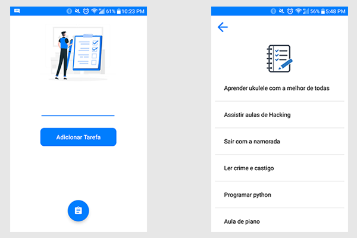

# Tarefas 


App que lista sua tarefas feito para matéria de programação mobile com **Android Studio**

## Conhecimetos adquiridos
* Trabalhar com **Sqlite** no android studio
* **ListView** com banco de dados 

## Códigos em java
* [Main activity (Tela inicial)](app\src\main\java\com\example\task\MainActivity.java)
* [List Task Activity (Parte que lista as tarefas)](app\src\main\java\com\example\task\ListTaskActivity.java)
* [Task Database (Classe do banco de dados)](app\src\main\java\com\example\task\TaskDatabase.java)

## Layouts
* [Activity Main](app\src\main\res\layout\activity_main.xml)
* [activity_list_task](app\src\main\res\layout\activity_list_task.xml)

## Cores 
```xml
<resources>
    <color name="colorPrimary">#007dfe</color>
    <color name="colorPrimaryDark">#3700B3</color>
    <color name="colorAccent">#03DAC5</color>
</resources>
```


## Classe do Banco de dados
```java
public class TaskDatabase
```

### Atributos 
```java
private SQLiteDatabase database;
private Activity activity;
```

### Método construtor
```java
TaskDatabase(Activity activity){
    this.activity = activity;
}
```

### Setando o banco sqlite
```java
// database: banco de dados
void setDatabase(SQLiteDatabase database) {
    this.database = database;
}
```

### Criando o banco de dados 
```java
void database(){
    try {
        // vai criar o banco de dados caso não exista a tabela myTask
        database.execSQL("CREATE TABLE IF NOT EXISTS myTasks(id INTEGER PRIMARY KEY AUTOINCREMENT, task VARCHAR)");

    }catch (Exception e){
        // se der algum erro, mostrar no terminal
        e.printStackTrace();

    }
}

``` 
### Adicionando tarefa no banco de dados
```java
// addTask: tarefa digitada pelo usuário.
void addTask(String addTask){
    try{
        if(addTask.equals("")){
            // caso não tenha digitado nada, 
            //pedir para o usuário digitar uma tarefa valida
            Toast.makeText(activity, "Por Favor, Inserir uma tarefa valida", Toast.LENGTH_SHORT).show();

        }else{
            // caso tenha digitado um valor valido
            //inserir na tabela myTasks e no atributo task a tarefa do usuário
            database.execSQL("INSERT INTO myTasks(task) VALUES ('"+addTask+"')");

            // notificar o usuário, falando que uma nova tarefa foi adicionada
            Toast.makeText(activity, "Tarefa "+ addTask + " inserida!", Toast.LENGTH_SHORT).show();
        }

    }catch (Exception e){
        e.printStackTrace();

    }
}
```

### Carregando as tarefas adicionadas pelo usuário
```java
// items: array de tarefas adicionados pelo usuário
// ids: id dessas tarefas 
void loadTask(ArrayList<String> items, ArrayList<Integer> ids){
    
    // pegando todas as colunas da tabela myTasks
    Cursor cursor = database.rawQuery("SELECT * FROM myTasks ORDER BY id DESC", null);

    // pegando os indexs das colunas 
    int indexColumnID = cursor.getColumnIndex("id");
    int indexColumnTask = cursor.getColumnIndex("task");

    // caso não vir dados vazios
    if (cursor != null) {
        // adicionando as tarefas do banco de dados nos arrays
        while (cursor.moveToNext()) {
            ids.add(Integer.parseInt(cursor.getString(indexColumnID)));
            items.add(cursor.getString(indexColumnTask));
        }
        cursor.close();
    }

}
```

### Deletar tarefas do banco de dados
```java
// id: o id do item clicado 
void deleteTask(Integer id){
    try{
        // excecutar o código sql que deleta item do banco
        database.execSQL("DELETE FROM myTasks WHERE id="+id);

        // notificar o usuário que a tarefa foi removida
        Toast.makeText(activity, "Tarefa Removida", Toast.LENGTH_SHORT).show();
    }catch (Exception e){
        e.printStackTrace();
    }
}
```

___
<h4 align="center">
    Feito com 💜 by  Vitor Carmo
</h4>